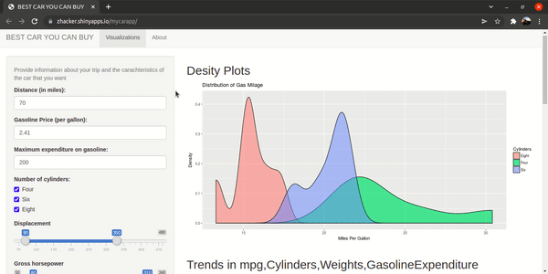

# MYcarapp

In this Project A shiny App is build to select the best car according to users requirement by using dynamic dashboard for convenient selection

## Usage
__Welcome to the “Best Car You CAN BUY” app, that was developed for visualization and car selection accroding to your needs.__
- First, you need to inform the distance of your trip and the price of gasoline in your region. These information will be used to calculate the Gasoline Expenditure for each car in the dataset. Then, you can enter the maximum amount of money you want to spend on gasoline, and the table shows only the cars that have Miles per Gallon (mpg) that can go below this value.__

- Second, you can choose some caractheristcs of the cars that you desire: Cylinders, Displacement, Horse Power and Transmission. The table will show only the cars with the filters selected. You can sort the table according to the variable you want by clicking the arrows at the top of the table.

- You Can Also Visualize The datasets insights and modify according to your interest with sidepanel menu.

## Demo

## Links

- Shiny web app : [Mycarapp](http://zhacker.shinyapps.io/mycarapp)
- R presentation : [Presentation](http://rpubs.com/zhacker/datapres)
